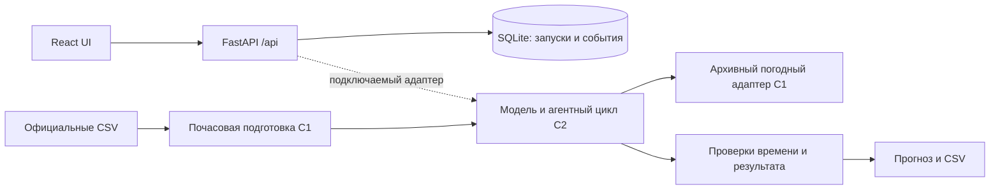

# QwertyS — почасовой прогноз мощности ВЭС

HackAlem AI 2026. Система для диспетчера двух ветротурбин в Шелекском коридоре: получить прогноз на 24/48 часов, проверить происхождение погодного выпуска, просмотреть действия расчёта и выгрузить CSV.

**Состояние на 23.09.2026, 14:40 UTC+5:** подготовка SCADA, погодный адаптер, HTTP API и интерфейс реализованы отдельными компонентами; подключение численной модели и полный февральский расчёт ещё выполняются. Без подключённого ядра API возвращает `503 not_ready`. Синтетический пример UI не является прогнозом. Метрики модели пока не опубликованы.

## Быстрый запуск

Требуются Python 3.12, Node.js 22.18+ (проверено с 24.21), npm, Git. Команды выполняются из корня репозитория. Для полной рабочей версии используйте согласованную интеграционную ветку `coord/hackalem-start`.

```powershell
python -m venv .venv
.venv/Scripts/python.exe -m pip install -r requirements-lock.txt
.venv/Scripts/python.exe -m pytest -q
.venv/Scripts/python.exe -m uvicorn src.api.main:app --host 127.0.0.1 --port 8000
```

Во втором терминале:

```powershell
cd web
npm.cmd ci
npm.cmd run dev
```

Откройте `http://localhost:5173`. На Windows используйте `npm.cmd`, если политика PowerShell блокирует `npm.ps1`. На Linux/macOS замените `.venv/Scripts/python.exe` на `.venv/bin/python`, а `npm.cmd` на `npm`.

Проверка сервера: `http://127.0.0.1:8000/api/health`. Схемы и интерактивные запросы: `/docs`; JSON OpenAPI: `/openapi.json`. В режиме разработки Vite перенаправляет `/api` на порт 8000. После `npm.cmd run build` из `web/` перезапустите backend: при наличии `web/dist` он обслуживает UI на `http://127.0.0.1:8000/`.

Сервер запускается **одним worker**. Одновременно выполняется один расчёт, очередь ограничена четырьмя запросами. Журнал и результаты хранятся локально в `.local/runs.sqlite3`; после перезапуска завершённые результаты сохраняются, незавершённые помечаются ошибкой.

## Данные и настройки

Получите два исходных CSV из официальной выдачи организаторов. Не загружайте их в Git. Файлы содержат 142 360 и 149 499 строк с шагом около 10 минут за 11.03.2023–31.01.2026. Факта за февраль 2026 нет, хотя февраль указан в названиях файлов.

```powershell
.venv/Scripts/python.exe scripts/verify_data.py "PATH_TO_OFFICIAL_CSV_DIRECTORY"
```

Команда сверяет размер и SHA-256 с [манифестом](coordination/DATA_MANIFEST.json), не изменяя CSV. Обе контрольные суммы проверены на ноутбуке 2.

Скопируйте `.env.example` в `.env`, задайте необходимые локальные параметры:

| Переменная | Назначение |
|---|---|
| `DATA_DIR` | Каталог официальных локальных CSV; используется ядром после подключения |
| `RUN_STORE_PATH` | SQLite-журнал; по умолчанию `.local/runs.sqlite3` |
| `FORECAST_RUNNER` | Согласованный адаптер `src.agent.module:function`; пусто — честный `not_ready` |
| `OPENAI_API_KEY`, `OPENAI_MODEL` | Только для реализованного LLM-режима ядра; не требуются для запуска HTTP API |
| `NVIDIA_API_KEY` | Только при фактическом подключении соответствующего провайдера |

Ключи не передаются в браузер и не коммитятся. Точный модуль расчёта и команда обучения будут добавлены после передачи проверенного ядра C2; произвольный пример имени адаптера не является готовой командой запуска модели.

## Устройство



| Компонент | Код / назначение |
|---|---|
| Подготовка данных | `src/data/scada.py`: среднее уникальных 10-минутных наблюдений в часе, покрытие и флаги качества |
| Погода | `src/weather/open_meteo.py`: Open-Meteo Single Runs, сохранение ответа и SHA, выбор 24/48 часов |
| Контракты | `src/contracts/schemas.py`: часовой пояс, горизонты, идентификаторы, проверка будущих входов |
| HTTP и хранение | `src/api/`: очередь, состояние, журнал, прогноз, экспорт, сохранение прежних запусков |
| Интерфейс | `web/`: выбор параметров, график, таблица, события, происхождение, явно помеченная синтетика |
| Модель и агент | `src/ml/`, `src/agent/`, `src/cli/` — ожидаются от C2; до интеграции численный сценарий недоступен |

API: `POST /api/runs`, `GET /api/runs`, `GET /api/runs/{id}`, `/forecast`, `/events`, `/export.csv`. Ошибки имеют вид `{"error":{"code":"not_ready","message":"…","retryable":false}}`. Новый POST создаёт отдельный запуск и сохраняет предыдущие результаты. [Контракт подключения ядра](docs/verification/C4-api-handoff.md).

## Как проверяется достоверность

- Мощность выдаётся в исходных нормализованных единицах, не в МВт или МВт·ч. API не применяет неподтверждённый clipping.
- Временные метки API содержат offset; ответы нормализуются в UTC. SCADA UTC+6 — гипотеза, отображаемая как `inferred`.
- `weather_available_at <= issue_time < valid_time`. Проверяются также горизонты, повторяющиеся часы и соответствие запросу. Пропуски не превращаются в нули.
- Время инициализации погодной модели отличается от публикации. Текущая политика C1 **run + 9 часов** помечена `inferred_run_plus_9h`, `provenance_status=unconfirmed`; это запас, а не доказанное историческое время публикации. [Обоснование ограничения](coordination/research/C1/availability-correction.md).
- Метрики февраля не вычисляются без фактических наблюдений. Историческая проверка должна сравнивать модель и baseline на одинаковых часах с доступными тогда входами.
- Транспортные события `api.*` подтверждают действия сервера, но сами по себе не доказывают LLM-agent tool calling. Реальные инструменты и режим выполнения передаёт ядро.

## Проверки и ограничения

На ноутбуке 2: `python -m pytest -q` — **21 проверка прошла** (19 API + 2 C1); `pip check` — без конфликтов. API-тесты используют **инъецированный синтетический stub**, а не реальные результаты модели. Проверены 24/48 часов, CSV, повторный запуск, перезапуск сервера, переполненная очередь, недопустимые даты, будущая погода, ошибки модели и отсутствие ключей в сообщениях об ошибках.

Версия UI Claude проверена отдельно в Chrome: реальный health/503, помеченная синтетика, горизонты 24/48, скачивание CSV, узкий экран; ошибок JavaScript не обнаружено. Сквозной реальный прогноз и обучение пока не проверены. HTTP manifest/lock пока не включают ещё не переданные зависимости ML.

Публичный хостинг, авторизация пользователей и автоматическое завершение зависшей функции обучения не реализованы. Тайм-ауты внешних вызовов обеспечивает ядро. Перед сдачей требуется чистый запуск согласованной версии с фактической моделью и погодными входами.

Исследования: [анализ данных](docs/analysis.md), [реестр проверенных и открытых фактов](coordination/RESEARCH.md). Организация командной работы: [START_HERE](coordination/START_HERE.md). Ссылки и сравнения в исследовательских заметках не являются измеренными результатами продукта.
