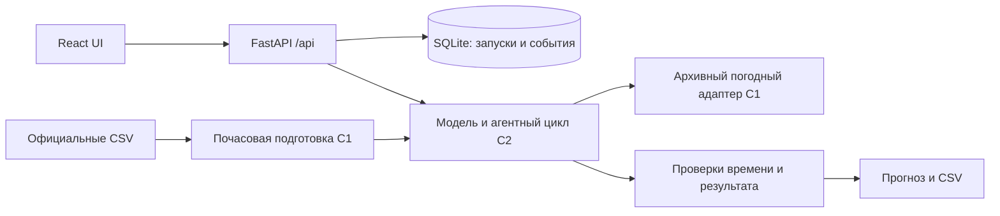

# QwertyS — почасовой прогноз мощности ВЭС

HackAlem AI 2026. Система для диспетчера двух ветротурбин в Шелекском коридоре: получить прогноз на 24/48 часов, проверить происхождение погодного выпуска, просмотреть действия расчёта и выгрузить CSV.

**Проверено на ноутбуке 2, 23.09.2026:** реальный детерминированный прогноз через API и Chrome, совпадение таблицы/CSV/API, независимое обучение и пересчёт январских метрик, февральский replay. Историческая публикация погоды и часовой пояс SCADA не подтверждены; успешный live LLM/GPU-проход пока не проверен. Без готовой модели/кэша API возвращает `503 not_ready`. Синтетический пример UI явно помечен и не является прогнозом.

## Быстрый запуск

Требуются Python 3.12, Node.js 22.18+ (проверено с 24.21), npm, Git. Команды выполняются из корня репозитория. Для полной рабочей версии используйте согласованную интеграционную ветку `coord/hackalem-start`.

```powershell
python -m venv .venv
.venv/Scripts/python.exe -m pip install -r requirements-lock.txt
.venv/Scripts/python.exe -m pytest -q
New-Item -ItemType Directory -Force models/production
Copy-Item coordination/research/C2/model-manifest-v1.json models/production/manifest.json
.venv/Scripts/python.exe -m src.weather.batch_archive --start-date 2026-01-31 --end-date 2026-02-28 --sleep-seconds 1
$env:FORECAST_RUNNER='src.agent.runner:run_forecast'
$env:MODEL_DIR='models/production'
$env:WEATHER_RUNS_DIR='artifacts/c1/weather_runs'
$env:AGENT_MODE='deterministic'
.venv/Scripts/python.exe -m uvicorn src.api.main:app --host 127.0.0.1 --port 8000
```

Во втором терминале:

```powershell
cd web
npm.cmd ci
npm.cmd run dev
```

Откройте `http://localhost:5173`. Первый сценарий: 31.01.2026, 17:00 UTC+5 (=12:00 UTC), 48ч → «Запустить агента» → таблица/события → «Скачать CSV». Кэш подготовлен для ежедневных выпусков 12:00 UTC; произвольный час может не иметь полного горизонта. Для первого одиночного расчёта достаточно загрузить только 31.01; диапазон нужен для replay. Опубликованный JSON содержит саму выбранную модель — две NWP-кривые мощности; исходные SCADA нужны для переобучения, а не этого запуска.

На Windows используйте `npm.cmd`, если политика PowerShell блокирует `npm.ps1`. На Linux/macOS замените `.venv/Scripts/python.exe` на `.venv/bin/python`, `npm.cmd` на `npm`, а `$env:...` на `export ...` или локальную `.env`.

Проверка сервера: `http://127.0.0.1:8000/api/health`. Схемы и интерактивные запросы: `/docs`; JSON OpenAPI: `/openapi.json`. В режиме разработки Vite перенаправляет `/api` на порт 8000. После `npm.cmd run build` из `web/` перезапустите backend: при наличии `web/dist` он обслуживает UI на `http://127.0.0.1:8000/`.

Сервер запускается **одним worker**. Одновременно выполняется один расчёт, очередь ограничена четырьмя запросами. Журнал и результаты хранятся локально в `.local/runs.sqlite3`; после перезапуска завершённые результаты сохраняются, незавершённые помечаются ошибкой.

После подготовки модели, кэша и сборки `web/` можно запускать одной командой `.venv/Scripts/python.exe scripts/run_local.py`. Она использует порт 8000, `models/production`, `artifacts/c1/weather_runs` и явный deterministic-режим. `--check` проверяет готовность без сервера; `--model-dir`/`--weather-dir` задают свои каталоги. Для осознанного реального LLM-режима предусмотрен `--agent-mode live` с локально настроенным ключом и лимитом расходов.

## Данные и настройки

Получите два исходных CSV из официальной выдачи организаторов. Не загружайте их в Git. Файлы содержат 142 360 и 149 499 строк с шагом около 10 минут за 11.03.2023–31.01.2026. Факта за февраль 2026 нет, хотя февраль указан в названиях файлов.

```powershell
.venv/Scripts/python.exe scripts/verify_data.py "PATH_TO_OFFICIAL_CSV_DIRECTORY"
```

Команда сверяет размер и SHA-256 с [манифестом](coordination/DATA_MANIFEST.json), не изменяя CSV. Обе контрольные суммы проверены на ноутбуке 2.

Скопируйте `.env.example` в `.env`, задайте необходимые локальные параметры:

| Переменная | Назначение |
|---|---|
| `MODEL_DIR` | Каталог с manifest.json; по умолчанию models/production |
| `WEATHER_RUNS_DIR` | Для приведённых команд C1: artifacts/c1/weather_runs |
| `AGENT_MODE` | deterministic для проверенного сценария; live/auto требуют согласованного доступа и расходов |
| `RUN_STORE_PATH` | SQLite-журнал; по умолчанию `.local/runs.sqlite3` |
| `FORECAST_RUNNER` | `src.agent.runner:run_forecast`; пусто — честный `not_ready` |
| `OPENAI_API_KEY`, `OPENAI_MODEL` | Только для реализованного LLM-режима ядра; не требуются для запуска HTTP API |
| `NVIDIA_API_KEY` | Только при фактическом подключении соответствующего провайдера |
| `EVALUATION_PATH` | JSON исторических метрик; по умолчанию coordination/research/C2/evaluation-v1.json |

Ключи не передаются в браузер и не коммитятся. Детерминированному режиму API-ключ не нужен. Health проверяет наличие модели/погодного кэша; покрытие конкретной даты проверяется в расчёте.

## Обучение, метрики и февральский replay

```powershell
.venv/Scripts/python.exe -m src.data.scada --input "PATH_TO_TURBINE_1.csv" --turbine-id turbine_1 --output artifacts/c1/scada-t1-hourly.jsonl --report artifacts/c1/scada-t1-report.json
.venv/Scripts/python.exe -m src.data.scada --input "PATH_TO_TURBINE_2.csv" --turbine-id turbine_2 --output artifacts/c1/scada-t2-hourly.jsonl --report artifacts/c1/scada-t2-report.json
.venv/Scripts/python.exe -m src.weather.batch_archive --start-date 2025-11-01 --end-date 2026-02-28 --sleep-seconds 1
.venv/Scripts/python.exe -m src.weather.verify_archive --start-date 2025-11-01 --end-date 2026-02-28
.venv/Scripts/python.exe -m src.ml.train --scada-dir artifacts/c1 --weather-dir artifacts/c1/weather_runs --output-dir models/production --report artifacts/evaluation.json
.venv/Scripts/python.exe scripts/verify_evaluation.py --report artifacts/evaluation.json --scada-dir artifacts/c1 --weather-dir artifacts/c1/weather_runs --output artifacts/independent-metrics.json
.venv/Scripts/python.exe -m src.cli.replay --model-dir models/production --weather-dir artifacts/c1/weather_runs --output-dir artifacts/replay
```

Два расширяющихся временных validation-fold до января сравнивают baseline NWP→power с тремя фиксированными вариантами CatBoost. В обоих случаях выбран baseline. Январь открывается после выбора; затем production-модель переобучается на всех пригодных парах до 31.01.2026. Признаки не используют будущую SCADA. Единица метрик — пара (issue_time, target_hour), вес каждой пары 1; перекрывающиеся выпуски сохранены.

Независимо воспроизведено: обучение 15,328с; 1390 январских пар на турбину, 707 уникальных целевых часов. Метрики в исходных нормализованных единицах:

| Турбина | Baseline MAE | Baseline RMSE | CatBoost RMSE | Bias baseline (прогноз−факт) |
|---|---:|---:|---:|---:|
| Т1 | 0,190351 | 0,243279 | 0,253398 | +0,074741 |
| Т2 | 0,190407 | 0,243430 | 0,254650 | +0,073179 |

[Независимые метрики](docs/verification/independent-metrics.json) включают lead 1–24/25–48 и SHA. Проверяющий скрипт не импортирует модель: сам пересчитывает метрики из CSV, сверяет labels с SCADA, покрытие и времена. [Отчёт C2](coordination/research/C2/evaluation-v1.json) содержит validation/trials. Численные метрики совпали в пределах 1e-12; SHA повторно загруженных HTTP-ответов и model_version могут отличаться из-за служебных полей, что не доказывает различие численных данных.

Актуальный replay C2 включает 29 ежедневных выпусков 31.01–28.02. Независимо воспроизведены 2784 строки полного журнала и 1344 уникальных прогноза (672 часа × 2 турбины). В новом UUID-каталоге — manifest.json, all-issues.csv, february.csv и отдельные запуски. Календарь февраля использует гипотезу UTC+6; для каждого часа выбран самый новый сохранённый выпуск с lead≥1. Правило предложено командой, не подтверждено организатором. Это прогноз/replay, **не измеренная точность февраля**.

## Устройство



| Компонент | Код / назначение |
|---|---|
| Подготовка данных | `src/data/scada.py`: среднее уникальных 10-минутных наблюдений в часе, покрытие и флаги качества |
| Погода | `src/weather/open_meteo.py`: Open-Meteo Single Runs, сохранение ответа и SHA, выбор 24/48 часов |
| Контракты | `src/contracts/schemas.py`: часовой пояс, горизонты, идентификаторы, проверка будущих входов |
| HTTP и хранение | `src/api/`: очередь, состояние, журнал, прогноз, экспорт, сохранение прежних запусков |
| Интерфейс | `web/`: выбор параметров, график, таблица, события, происхождение, явно помеченная синтетика |
| Модель и агент | `src/ml/`, `src/agent/`, `src/cli/`: обучение, численный прогноз, инструменты, replay |

API: `POST /api/runs`, `GET /api/runs`, `GET /api/runs/{id}`, `/forecast`, `/events`, `/export.csv`, `GET /api/evaluation`. Ошибки имеют вид `{"error":{"code":"not_ready","message":"…","retryable":false}}`. Новый POST создаёт отдельный запуск и сохраняет предыдущие результаты. [Контракт подключения ядра](docs/verification/C4-api-handoff.md).

## Как проверяется достоверность

- Мощность выдаётся в исходных нормализованных единицах, не в МВт или МВт·ч. API не применяет неподтверждённый clipping.
- Временные метки API содержат offset; ответы нормализуются в UTC. SCADA UTC+6 — гипотеза, отображаемая как `inferred`.
- `weather_available_at <= issue_time < valid_time`. Проверяются также горизонты, повторяющиеся часы и соответствие запросу. Пропуски не превращаются в нули.
- Время инициализации погодной модели отличается от публикации. Текущая политика C1 **run + 9 часов** помечена `inferred_run_plus_9h`, `provenance_status=unconfirmed`; это запас, а не доказанное историческое время публикации. [Обоснование ограничения](coordination/research/C1/availability-correction.md).
- Метрики февраля не вычисляются без фактических наблюдений. Историческая проверка должна сравнивать модель и baseline на одинаковых часах с доступными тогда входами.
- Транспортные события `api.*` подтверждают действия сервера, но сами по себе не доказывают LLM-agent tool calling. Реальные инструменты и режим выполнения передаёт ядро.

## Проверки и ограничения

На чистой среде ноутбука 2: `python -m pytest -q` — **34 проверки прошли**; `pip check` — без конфликтов. Часть тестов использует явные синтетические fixtures для проверки границ. Отдельно `python scripts/smoke_api.py` создаёт три настоящих запуска готовой модели, сверяет CSV/API и сохранность прежнего результата.

Реальный Chrome подтвердил 24/48ч, совпадение всех табличных значений (округление 3 знака) и точных CSV/API, отсутствие JS-ошибок, ширину 390px без переполнения. Три реальных API-прогона заняли 0,135–0,143с на данном ноутбуке в детерминированном режиме; это не обещание скорости LLM/сети. Manifest/lock включает ML-зависимости и проверен в новой venv. [Матрица приёмки](docs/verification/acceptance-matrix.md) отдельно фиксирует оставшиеся ограничения.

Публичный хостинг, авторизация пользователей и автоматическое завершение зависшего Python-потока не реализованы. Тайм-ауты внешних вызовов обеспечивает ядро. Независимо проверенный здесь режим — deterministic с настоящими weather→prepare→forecast→validate→export, он не означает LLM-вызов. C2 опубликовал [журнал реального LLM-прохода с сетевой погодой](coordination/research/C2/live-network-smoke-v2.json): 6 ответов, 5 инструментов, 48 численных строк, 11,297с. C4 сверил согласованность событий/usage, но не повторял платный вызов с личным ключом на ноутбуке2. Фактическая GPU job пока не подтверждена.

Исследования: [анализ данных](docs/analysis.md), [реестр проверенных и открытых фактов](coordination/RESEARCH.md). Организация командной работы: [START_HERE](coordination/START_HERE.md). Ссылки и сравнения в исследовательских заметках не являются измеренными результатами продукта.
