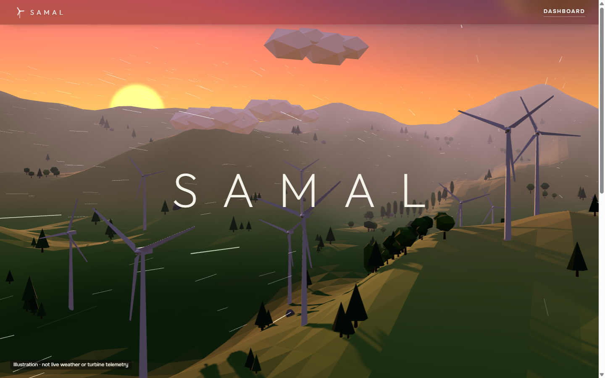
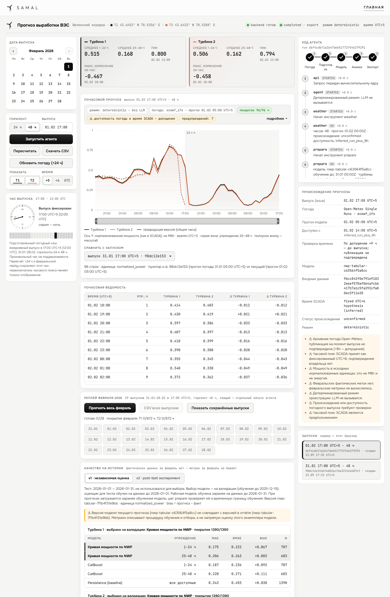
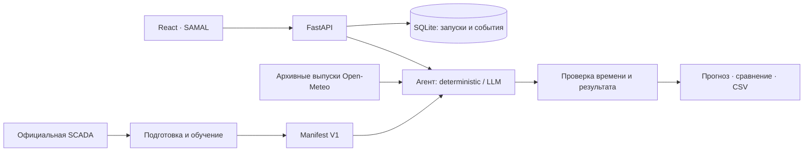

# SAMAL — почасовой прогноз мощности ВЭС

**Почасовой прогноз мощности двух ветротурбин Шелекского коридора на 24 и 48 часов.** Проект команды QwertyS для HackAlem AI 2026.

SAMAL соединяет архивный погодный прогноз, обученную на SCADA модель и агентный рабочий процесс. Диспетчер получает численный прогноз, сравнивает его после обновления погоды, проверяет происхождение входов и выгружает CSV. Все действия и предыдущие результаты сохраняются.

[Быстрый запуск](#быстрый-запуск) · [Результаты](#модель-и-результаты) · [Воспроизводимость](docs/REPRODUCIBILITY.md) · [Демонстрация за 4 минуты](coordination/FINAL_DELIVERY.md) · [Соответствие кейсу](coordination/CASE_ALIGNMENT_1505.md)



3D-сцена главной страницы — иллюстрация. Рабочий экран ниже показывает настоящий результат API и сравнение двух погодных выпусков.



[Лендинг на телефоне, 390 px](docs/demo/SAMAL-sunset-landing-mobile-390.png) · [Рабочий экран на телефоне, 390 px](docs/demo/SAMAL-dashboard-mobile-390.png) · [Проверка подключения финального интерфейса к API](coordination/messages/20260923T174100+0500-CLAUDE-READY-samal-backend-final.md).

## Кейс

Организаторы предоставили историю двух ветротурбин Шелекского коридора. Требуется обучить модель почасовой мощности и реализовать агентный цикл: получить открытый погодный прогноз по координатам, подготовить входы, рассчитать следующие 24–48 часов, проанализировать результат и пересчитать его после обновления погоды. Последовательность расчётов начинается 31 января и охватывает февраль 2026 года.

В исходных CSV — 142 360 и 149 499 наблюдений с шагом около 10 минут за 11.03.2023–31.01.2026. Фактических значений февраля нет. Результат проекта — воспроизводимый локальный продукт, численные прогнозы, журнал действий и CSV для дальнейшего использования диспетчером.

## Как выполнено решение

1. **Проверили данные.** Зафиксировали SHA-256 официальных CSV, исследовали пропуски и дубли. Уникальные 10-минутные наблюдения агрегировали в почасовые средние с контролем покрытия.
2. **Подготовили погоду.** Использовали Open-Meteo Single Runs / ECMWF IFS. Сохраняем исходный ответ и его SHA, проверяем единицы, время инициализации и горизонт. Принятая задержка доступности +9 часов явно указана в результате.
3. **Обучили и сравнили модели.** На временных разбиениях сравнили эмпирические кривые мощности и CatBoost; отдельно провели нейросетевые эксперименты на NVIDIA T4. Производственная модель выбрана по измеренным результатам и критериям устойчивости.
4. **Собрали агентный цикл.** Инструменты получают погоду, подготавливают входы, вызывают модель, проверяют результат и формируют экспорт. LLM управляет вызовами инструментов; значения мощности берутся из численной модели.
5. **Подключили интерфейс.** Диспетчер выбирает дату и горизонт, видит прогноз и события, запускает обновление +24 часа и сравнивает сохранённые выпуски.
6. **Проверили воспроизводимость.** Выполнили независимый пересчёт метрик, строгий аудит, исправление выявленных программных ошибок, запуск на втором ноутбуке и сравнение API с CSV.

## Что работает

- **Прогноз на 24/48 часов:** отдельные ряды двух турбин, график, таблица, сводка и CSV.
- **Обновление погоды на +24 часа:** новый расчёт и сравнение с предыдущим на общих часах.
- **Наблюдаемый агент:** weather → prepare → forecast → validate → export, журнал инструментов и происхождение данных.
- **Два режима:** deterministic без платного API и live с реальным LLM tool calling. Численные значения вычисляет модель.
- **Февральский replay:** 29 ежедневных выпусков, 2 784 строки журнала и 1 344 выбранных прогноза для февраля.
- **Воспроизводимость:** готовая V1 в JSON, фиксированные зависимости, проверки входов, SQLite-история и отчёты независимых проверяющих.

## Быстрый запуск

Требуются **Python 3.12, Node.js 24, npm и Git**. Команды ниже — для PowerShell из корня клонированного репозитория. Для первого запуска нужен интернет: установить зависимости и скачать два погодных выпуска. API-ключ и GPU не нужны; переобучение не требуется.

```powershell
git clone https://github.com/BAITC-Hacks/hack-c0c67068-qwertys.git
cd hack-c0c67068-qwertys
python -m venv .venv
.venv/Scripts/python.exe -m pip install -r requirements-lock.txt
New-Item -ItemType Directory -Force models/production
Copy-Item coordination/research/C2/model-manifest-v1.json models/production/manifest.json
.venv/Scripts/python.exe -m src.weather.batch_archive --start-date 2026-01-31 --end-date 2026-02-01 --sleep-seconds 1
Push-Location web
npm.cmd ci
npm.cmd run build
Pop-Location
.venv/Scripts/python.exe scripts/run_local.py --check
.venv/Scripts/python.exe scripts/run_local.py
```

Откройте **http://127.0.0.1:8000/** и нажмите **Open dashboard**. Прямая ссылка на рабочий экран: **http://127.0.0.1:8000/#/dashboard**.

1. Выберите **31 января 2026, 17:00 UTC+5**, горизонт **48 ч** и нажмите «Запустить агента».
2. Проверьте 96 строк, график двух турбин и журнал действий.
3. Нажмите «Обновить погоду (+24 ч)», сравните пересечение прогнозов и скачайте CSV.

Поддерживаемое время выпуска зафиксировано: 17:00 UTC+5 = 12:00 UTC. Два скачанных выпуска покрывают этот демонстрационный сценарий. Для всех дат февраля скачайте полный кэш:

```powershell
.venv/Scripts/python.exe -m src.weather.batch_archive --start-date 2026-01-31 --end-date 2026-02-28 --sleep-seconds 1
```

Готовый JSON содержит две обученные кривые мощности. Исходные официальные CSV нужны только для переобучения и независимого пересчёта метрик. На Linux/macOS используйте `.venv/bin/python`, `npm`, `mkdir -p`, `cp`, а вместо `Push-Location`/`Pop-Location` — `cd web`/`cd ..`.

### Реальный LLM-режим

Скопируйте `.env.example` в локальную `.env`, задайте `OPENAI_API_KEY`, `OPENAI_MODEL` и лимит `OPENAI_SESSION_BUDGET_USD` (по умолчанию 1 USD). Затем запустите:

```powershell
.venv/Scripts/python.exe scripts/run_local.py --agent-mode live
```

Ключ остаётся на сервере и не передаётся браузеру. `prepare` загружает уже обученную модель; каждый прогноз не запускает обучение заново. [Подтверждённый live-проход](coordination/research/C2/final-live-ui-evidence.json): 96 строк, совпадение API/CSV, 10,187 с на машине команды; это наблюдение, а не гарантия задержки.

### Диагностика запуска

| Ситуация | Что проверить |
|---|---|
| `Not ready` / HTTP 503 | Скопирован ли manifest, существует ли погодный кэш; выполните `scripts/run_local.py --check` |
| Нет прогноза на выбранную дату | Скачан ли соответствующий выпуск; health не гарантирует покрытие каждой даты |
| Вместо интерфейса нет страницы | Выполнена ли сборка `web/`, затем перезапущен ли сервер |
| PowerShell блокирует npm | Используйте `npm.cmd` |
| Нужен другой порт | `scripts/run_local.py --port 8010` |

Проверка готовности: `/api/health`. Интерактивная документация API: `/docs`. Локальный сервер работает одним worker; одновременно исполняется один расчёт, очередь ограничена четырьмя запросами. История хранится в `.local/runs.sqlite3`. Для разработки UI: запустите backend на 8000, затем `npm.cmd run dev` в `web/` — Vite проксирует `/api`.

## Модель и результаты

Основная **V1** — эмпирическая зависимость мощности от прогноза ветра, обученная отдельно для каждой турбины. На двух временных validation-fold до января она выбрана вместо трёх фиксированных кандидатов CatBoost. Признаки не используют будущую SCADA.

Первичная январская проверка: **1 390 пар «выпуск — целевой час» на турбину**, 707 уникальных целевых часов. Метрики в исходных нормализованных единицах мощности:

| Турбина | MAE V1 | RMSE V1 | RMSE CatBoost | Смещение V1 |
|---|---:|---:|---:|---:|
| Т1 | 0,190351 | 0,243279 | 0,253398 | +0,074741 |
| Т2 | 0,190407 | 0,243430 | 0,254650 | +0,073179 |

Оценённые модели обучались на targets до **01.01.2026**. После оценки production V1 переобучена на пригодных targets до **31.01.2026**: схема та же, параметры другие. Таблица не является измерением финальных production-весов. Независимый проверяющий пересчитал метрики с совпадением в пределах 1e-12. [Метрики и разбиения](docs/verification/independent-metrics.json) · [Процедура обучения и replay](docs/REPRODUCIBILITY.md).

### Что сделано на NVIDIA

На **NVIDIA T4** обучены residual MLP и Transformer по числовым признакам; сезонный цикл V4 включает шесть временных периодов и три seed. Сохранены **60 внешних нейросетевых checkpoint и 12 моделей CatBoost**.

В V4 средний RMSE MLP с поправкой: **0,248898 / 0,249107**, против **0,255378 / 0,253685** у кривой по полной истории. Улучшение средних 2,54% / 1,80% не прошло критерии устойчивости: доверительные интервалы включали нулевое улучшение, отдельные режимы и смещение не удовлетворили ограничениям. Поэтому V1 сохранена. Это исследование на уже рассматривавшихся периодах, не новый независимый тест.

[Отчёт обучения](coordination/research/C2/FINAL_QUALITY_REPORT_RU.md) · [Независимый аудит GPU-кандидата](docs/verification/model-quality/C5-V4-final.md). Финальный дополнительный V5-цикл не дал обученной модели; GPU остановлена, статус проверен по истории Brev в 17:24:32 UTC+5. Для запуска продукта исследовательские веса и GPU не нужны.

## Архитектура



| Каталог | Назначение |
|---|---|
| `src/data/`, `src/weather/` | Почасовая SCADA, погодный адаптер, единицы и происхождение входов |
| `src/ml/`, `src/agent/` | Обучение, численная модель, инструменты и проверка результата |
| `src/api/`, `src/cli/` | HTTP API, очередь, история и пакетный replay |
| `web/` | React/TypeScript, график, таблица, календарь, журнал, 3D-лендинг |
| `tests/`, `web/tests/` | Проверки контрактов, границ и поддерживаемого времени выпуска |
| `docs/verification/` | Независимые метрики и техническая приёмка |
| `coordination/` | Доказательства исследований, правила и история командной работы |

Основные endpoints: `POST /api/runs`, `GET /api/runs`, `GET /api/runs/{id}`, `/forecast`, `/events`, `/export.csv`, `GET /api/evaluation`. Полные схемы — в `/docs`. Модель/кэш не готовы — явный `503 not_ready`; отсутствующие значения не подменяются нулями.

## Проверка качества

| Проверка | Подтверждённый результат |
|---|---|
| Полный Python-набор с исследовательскими зависимостями | **94 теста + 15 подтестов PASS** |
| Повторный строгий аудит ядра `746a0a8` | **30/30 адресных проверок PASS**, семь программных нарушений закрыты |
| Финальный frontend `1d415b7`, ноутбук 2 и интеграционная сборка | Чистый `npm ci`, **2/2 Node-теста**, TypeScript/Vite build, lint exit 0 |
| Браузерная приёмка ядра | 24/48 ч → +24 ч → сравнение → CSV; replay **29/29** |
| Финальный SAMAL в Chrome | Реальные 96 строк, CSV доступен, предупреждение о допущениях видно; console errors/warnings: **0** |

[Строгий повторный аудит](coordination/research/C3/strict-reaudit-746a0a8.md) · [Проверка финального frontend другим ноутбуком](coordination/messages/20260923T173511+0500-CLAUDE-VERIFY-final-main-6ceab13.md) · [Чистая установка ядра](coordination/research/C2/clean-core-1895090.md).

```powershell
.venv/Scripts/python.exe -m pytest -q
Push-Location web
node --test tests/*.test.mjs
npm.cmd run build
npm.cmd run lint
Pop-Location
```

Базовый Python lock не устанавливает Torch: optional-тесты нейросетей могут пропускаться. Синтетические fixtures проверяют поведение программы, а не точность прогнозирования. GitHub Actions настроен на тесты, сборку и lint без ключей и исходных датасетов; hosted-результат пока не подтверждён. В финальной сборке остаются **7 предупреждений lint** и предупреждения о размере JS-бандлов, ошибок сборки нет.

## Условия интерпретации результатов

- **Историческая доступность погоды не подтверждена.** Политика `run + 9 часов` — явно обозначенное допущение, не доказательство времени публикации. [Разбор источника](coordination/research/C1/final-provenance-note.md).
- **UTC+6 для исходной SCADA — гипотеза.** Отображение интерфейса UTC+5 отдельно от интерпретации исходных данных.
- **Факта за февраль 2026 в выданных CSV нет.** 1 344 строки replay означают покрытие прогнозом, а не измеренную точность февраля. Правило выбора последнего доступного выпуска предложено командой.
- Мощность — в **исходных нормализованных единицах**, не МВт/МВт·ч; диапазон [0, 1] не гарантируется.
- V2/V3/V4 — исследования после просмотра января. Они не заменяют независимый новый holdout и не переключают рабочую модель при открытии вкладки метрик.
- Публичный хостинг, пользовательская авторизация и промышленный SLA не реализованы. Продукт предназначен для локальной демонстрации; автоматическое завершение зависшего Python-потока отсутствует.

Исходные CSV, API-ключи, локальные базы и тяжёлые исследовательские артефакты не публикуются в Git. Манифест официальных файлов: [DATA_MANIFEST.json](coordination/DATA_MANIFEST.json).

**Ветка сдачи — `main`.** Сценарий защиты и описание для платформы: [FINAL_DELIVERY.md](coordination/FINAL_DELIVERY.md). Публикация кода в GitHub не означает, что на платформе хакатона нажата кнопка сдачи.
