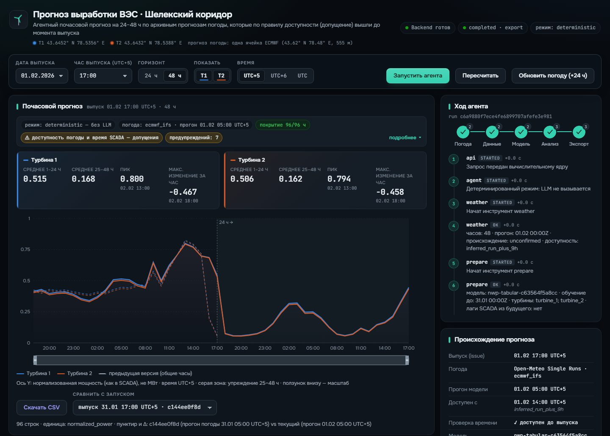
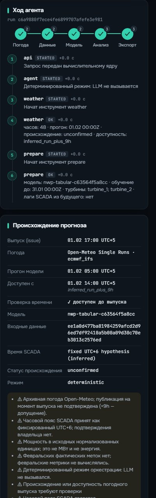
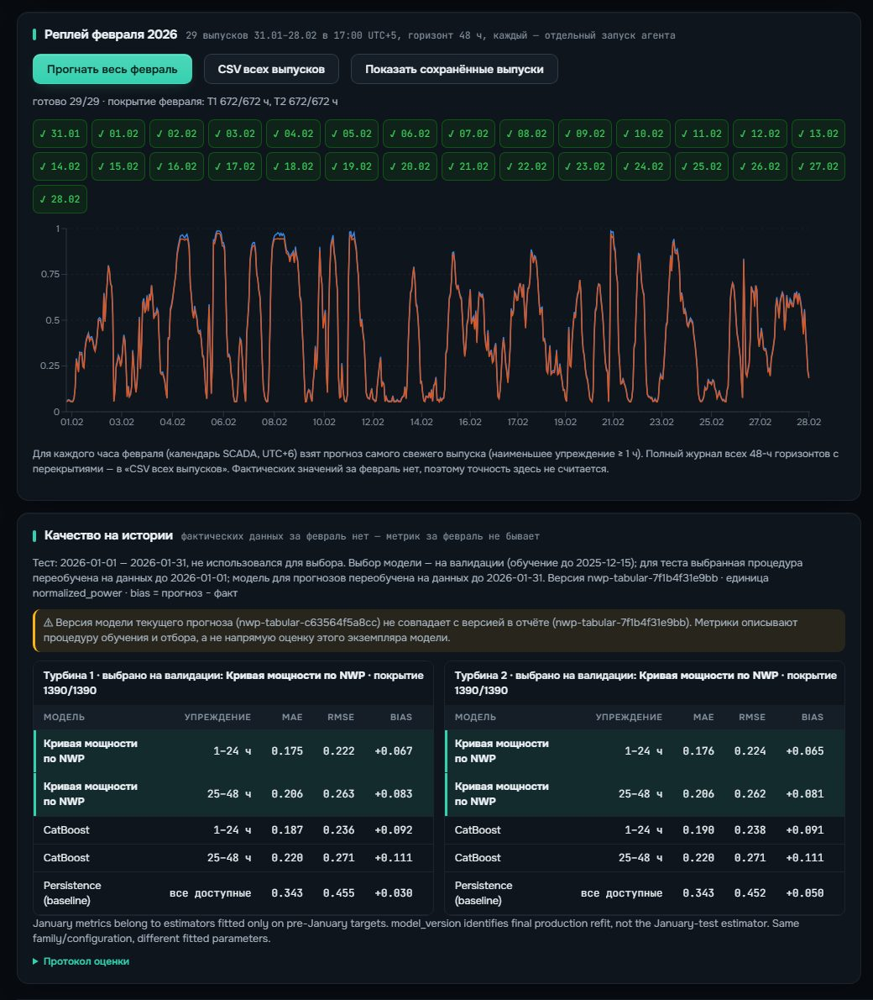

# UI evidence — real runs (CLAUDE)

Captured 2026-09-23 ~15:07 UTC+5 on laptop 2 with headless Edge against the **real** team stack:
`web/` (agent/claude-review 8c054b9) → Vite proxy `/api` → C4 FastAPI on `127.0.0.1:8000` with the C2 runner
(`FORECAST_RUNNER=src.agent.runner:run_forecast`, deterministic agent mode, model `nwp-tabular-c63564f5a8cc`) and C1 weather cache
(Open-Meteo Single Runs, `ecmwf_ifs`, one 00Z run per day). No mock, no synthetic data in these frames.

Every frame is reproducible from a URL (the UI restores the run from `GET /api/runs`):

| Frame | URL (with the same API database) |
|---|---|
| 1, 2 | `http://localhost:5173/?run=c6a9880f7ece4fe6899707afefe3e981&compare=c144ee0f8d194419a1fd3091d00656c0` |
| 3 | `http://localhost:5173/?replay=saved` (grid rebuilt from stored completed runs, no new calculations) |

Run IDs are local to that API database (`.local/runs.sqlite3`); on another machine run the scenario below and use the new IDs.

## Frame 1 — real forecast after a real input update

- Issue **01.02.2026 12:00Z (17:00 UTC+5)**, horizon 48 h, both turbines, 96 rows, coverage 96/96.
- The run was created with **«Обновить погоду (+24 ч)»** from the 31.01 issue (`c144ee0f…`): same target hours, but the agent used the
  **newer ECMWF run 01.02 00Z** instead of 31.01 00Z. Dashed = previous issue, solid = updated; Δ columns show the change on the 24 common
  hours (e.g. 01.02 20:00 UTC+5: −0.033). This is a genuine input change, not a repeat of the same input (a same-input «Пересчитать»
  gives Δ = 0.000 — also verified, run `6834e485…` vs `e4bb19e4…`).
- Trust strip above the chart states the mode (deterministic, no LLM), the weather run, coverage and that weather availability and the SCADA
  timezone are **assumptions**.
- KPI tiles are computed only from the returned rows (means per lead bucket, peak, largest hourly change). Units: normalized power, not MW.

## Frame 2 — the agent's actual tool calls and provenance

- Stage pipeline weather → prepare → forecast → validate → export, each with the number of real events from `GET /api/runs/{id}/events`.
- Event summaries are the runner's own outputs, parsed from JSON (e.g. weather: 48 h, run 01.02 00:00Z, provenance `unconfirmed`,
  availability `inferred_run_plus_9h`; prepare: model version, training cutoff 31.01 00:00Z, **future SCADA lags: no**).
- Provenance card: availability gate check «доступен до выпуска» (available 01.02 14:00 UTC+5 ≤ issue 17:00 UTC+5), input version hash,
  SCADA clock «fixed UTC+6 hypothesis (inferred)», all warnings returned by the API.

## Frame 3 — February replay and history-only metrics

- **29 issues 31.01–28.02**, each a separate agent run through the API; all completed. February coverage **672/672 h per turbine** in the SCADA
  calendar (UTC+6) — the same 1 344 pairs as the C2/C3 CLI replay. For every hour the freshest issue (smallest lead ≥ 1 h) is shown; the full
  overlapping 48 h journal is exported by «CSV всех выпусков». No February accuracy is shown — there are no February labels.
- «Качество на истории» renders `GET /api/evaluation` (C2 evaluation-v1) unchanged: January 2026 test, not used for selection; per turbine
  and lead bucket MAE / RMSE / bias / n. Selected model (weather-driven power curve) highlighted; CatBoost and persistence shown for
  comparison. The panel states the fit cutoffs (selection ≤ 15.12, test fit ≤ 01.01, production refit ≤ 31.01) and warns that the live model
  version differs from the evaluated estimator.

## Reproduce the scenario (≈2 min once the API is ready)

1. Start the API per README (C4) and the UI: `cd web && npm ci && npm run dev` → http://localhost:5173.
2. Issue 31.01.2026, 17:00 UTC+5, 48 h → «Запустить агента». Expect `completed`, 96 rows, 14 events, trust strip.
3. «Обновить погоду (+24 ч)» → new issue 01.02 17:00 with run 01.02 00Z, dashed overlay + Δ on common hours.
4. «Прогнать весь февраль» → 29 runs (~25 s on laptop 2), coverage 672/672; «CSV всех выпусков».
5. «Скачать CSV» on a single run → server CSV from `/api/runs/{id}/export.csv` (C4 verified values = table = API).

## Honest limitations visible in the UI

- Historical publication time of the ECMWF runs is **not proven**; the gate uses run + 9 h (C1/C3). Shown as an assumption, not a PASS.
- SCADA timezone UTC+6 is inferred; February calendar and replay selection rule are team interpretations (documented).
- Frames show the deterministic agent mode; the live LLM tool-calling mode is C2's separate evidence and is labelled `live` when used.
- Normalized power only; no MW/MWh, no uncertainty bands (no calibrated quantiles were delivered).

## UI defect list at 15:10

| # | Defect | Status |
|---|---|---|
| D1 | Stale poll response could overwrite a newly selected run (C4) | fixed 60f6a96 |
| D2 | Stale comparison response could overwrite a later selection (C4) | fixed 4fc7ef9 |
| D3 | Replay «Остановить» ignored inside a run's polling loop (C4) | fixed 60f6a96 |
| D4 | Header/footer implied confirmed weather availability (C4) | fixed 60f6a96 |
| D5 | Evaluation panel cutoff wording (C4) | fixed 4fc7ef9 / 4f907b9 |
| D6 | Raw JSON in agent event summaries | fixed 4c9bca1 |
| D7 | February window used UTC+5 instead of team SCADA calendar | fixed 1c65199 |
| D8 | «Остановить» stops only the client loop; runs already queued continue on the server (no cancel route) | open, documented |
| D9 | JS bundle > 500 kB (Recharts) — build warning only | open, cosmetic |
